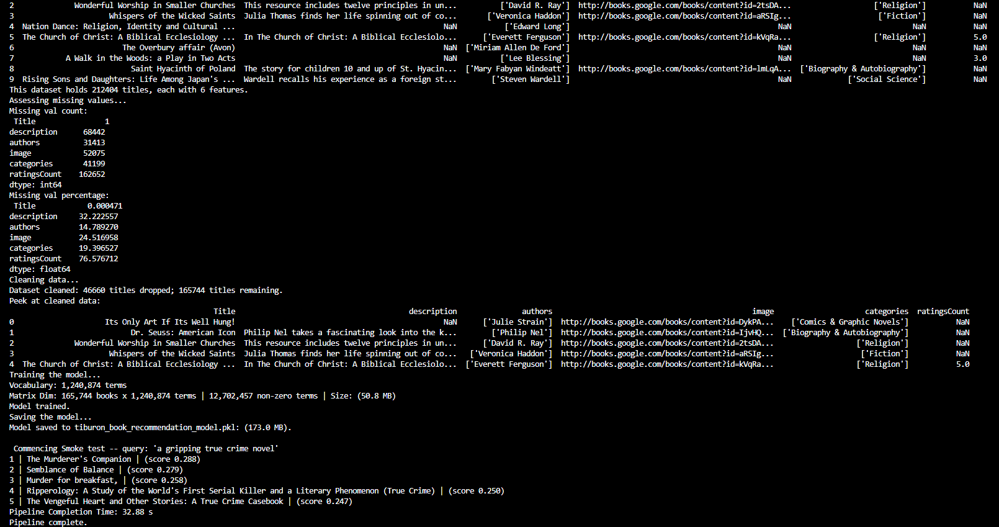

# Machine Learning Book Recommendation System Using Content-Based Filtering

## Machine Learning Pipeline

### `recommender.py`

* **Model Requirements**: This recommender system is a [content-based filtering model](https://www.geeksforgeeks.org/machine-learning/ml-content-based-recommender-system/). Though [collaborative-filtering (CF)](https://www.geeksforgeeks.org/machine-learning/collaborative-filtering-ml/) holds strong in situations in which user profiles already exist and share similar patterns in taste, the CF approach suffers from the *cold start* limitation (i.e. interactions from new users who do not have established history). By contrast, content-based filtering (CBF) is built on existing item metadata and features, making it the optimal choice for individuals who may not have established history.
  Implementation of two steps: *retrieval* and *ranking*
  * *Retrieval*: generate--retrieve--title candidates for each mentioned title
    * tests [clamping](https://www.geeksforgeeks.org/python/how-to-clamp-floating-numbers-in-python/) for *k* value
  * *Ranking*: rank those candidates, remove duplicates or consumed-titles

### `train_model.py`

* **Data Collection**: Ingests data (`Amazon Books Dataset: books_data.csv`)
* **Data Cleaning/Feature Engineering**: Dropping nulls using `load_and_preprocess()`
* **Data Labeling**: N/A - this is an unsupervised learning model
* **Feature Selection**: Loading data: only load the used features (i.e., 'Title', 'description', 'authors', 'categories', 'ratingsCount', 'image'). The remaining features (i.e., previewLink, publisher, publishedDate, and infoLink) are noise.  This helps
  streamline data parsing and cleaning, as well as storage management.
* **Model Training**: *Text frequency-inverse document frequency (TF-IDF)* - vectorizes the text; the corpus is represented as an M x N matrix. The number of titles (M) may differ from size of vocabulary (N); however, the size of the vector computed from each
  vectorized query (i.e., an 1 x N) must be compatible for matrix-vector multiplication to produce a dot product. Thus, the vector will be transposed to dimensions N x 1 to produce the dot product of M x 1, in which each title will have a score.
  Titles that are closer together in vector space will have a larger dot product or cosine similarity score. Titles are then sorted in descending order according to their scores so that similar titles are served based on the specified *k*.
* **Model Evaluation**: When building some recommendations (e.g., *You Might Like*, *Because You Viewed*, *For You*, etc.), the goal is to minimize the distance from a user's favorite title to another title, expressed as ||vt^k - vt^i||. This model uses a leave-one-out with precision@k evaluation method: consider users with 5+ liked titles, hide one title, build a query from the rest, evaluate whether the hidden book returns. Use W&B to sweep across `max_features` and `min_df` hyperparameters--strikes the balance between *memory* and *precision*.
  * Unittests:
    * `test_recommender.py`
      * `TestRecommenderFitting`
      * `TestRecommenderRetrieval`
      * `TestRecommenderSaveLoad`
    * test_api.py
      * `TestEndpointsWithoutModel`
      * `TestEndpointsWithModel`
      * `TestRequestValidation`

### Docker | Amazon Web Services

* **Model Deployment / Model Monitoring**: *Docker* containerization for environmental consistency and accessibility; *Amazon Elastic Compute Cloud* for deployment and monitoring
* NoSQL Cloud Database (DynamoDB):

  * Low-latency
  * Flexible
  * Automatic scalability
  * High Availability & Durability

### `create_table.py`

* DynamoDB Implementation:
  * For this project, one key scans several thousand items (i.e., retrieval logs). Scale would demand implementation of a composite key (partition key: `"PRED#2026-08-07",`sort key: `"2026-08-07T13:22:01Z#<uuid>")`for targeted queries. **Tradeoff**: The simple, single key is optimal for the project at hand. A composite key adds unnecessary complexity.
  * Timezone in UTC for agnostic time-tracking
  * Function as a Service (FaaS) - Only pay for what is used

### `main.py`

* Houses the fastAPI layer, which loads the Production model from the Registry
* Pydantic schemas for user TextInput validation
* Provides several endpoints:
  * `/` - returns the artifact
  * `/health` - confirms API functionality
  * `/retrieve` - retrieves a specified number of recommendations *k* from a single query
  * `/retrieve_from_queries` - retrieves a specified number of recommendations *k* from multiple queries
  * `/feedback` - attaches thumbs up/down to retrievals logged by `/retrieve` endpoint
  * `/example` - provides example of retrieval functionality by returning a random title from the catalog

## [Weights and Biases](https://wandb.ai/tiburon_0-university-of-denver/projects)

### `promote_model.py`

**Linking**:

* **Supports model lifecycle management & scope promotion**:

  * Enables CLI staging and promotion of model artifacts in the *Registry* (i.e., --list, --alias production)
* **Supports data lineage**:

  * Alias acts as mutable pointer, enabling changes in production without redeploying the highest-performing artifact.
    * **Importance**: Respects possibility of **model degradation**, **concept drift**, and **data drift**
* **Provides naming consistency for artifacts**:

  * **entity**: *tiburon_0-university-of-denver*
  * **project**: *content-based-book-recommender*
  * **artifact & version**: *tiburon-book-recommender:version*
  * **Project Namespace**: *tiburon_0-university-of-denver/content-based-book-recommender/tiburon-book-recommender:v1*)

Promotional decisions are currently rooted in time and space complexity, *cost optimization* (e.g., vocabulary size, model size, latency), pending development of the evaluation harness. So, the structuring enables seamless rollback and shifts in promotion necessitated by various business needs, shifts in priority balance (speed vs. accuracy).

Weights and Biases Project Dashboard: [wandb.ai/tiburon_0-university-of-denver/content-based-book-recommender?nw=nwusertiburon_0](https://wandb.ai/tiburon_0-university-of-denver/content-based-book-recommender?nw=nwusertiburon_0)

---

## System Architecture

Three containerized services across two EC2 instances. The two hosts never communicate directly; DynamoDB is the only shared state.

```text
                          YOUR BROWSER
                    |                        |
                  :8501                    :8501
        +---------------------+   +----------------------+
        |     APP HOST        |   |   MONITORING HOST    |
        |     (t3.small)      |   |     (t3.micro)       |
        |                     |   |                      |
        |  web   :8501        |   |   dash  :8501        |
        |    |  app_net       |   |                      |
        |  api   :8000        |   |                      |
        +----------+----------+   +-----------+----------+
                   |                          |
                   |  writes                  |  reads
                   +------->  DynamoDB  <------+
                        book_recommender_retrievals
                   |
                   | pulls :production at startup
                   v
             W&B Model Registry
```

The monitoring dashboard is a *separate application on a separate server*, exchanging data with the API through the database rather than through files. Docker volumes cannot span hosts, so a shared volume was never an option here--the database **is** the integration point.

| Service | Build context | Port | Reads | Writes |
| --- | --- | --- | --- | --- |
| `api` | `api/Dockerfile` | 8000 | W&B registry | DynamoDB |
| `web` | `web/Dockerfile` | 8501 | `api` over `app_net` | -- |
| `dash` | `monitoring/Dockerfile` | 8501 | DynamoDB | -- |

---

## Installation

### Prerequisites

| Requirement | Notes |
| --- | --- |
| Python 3.11 | Matches the Docker images |
| Docker | Required for the containerized services |
| W&B account | Free tier--experiment tracking and model registry |
| AWS account | DynamoDB plus two EC2 instances |
| ~4 GB disk | The two datasets total roughly 3 GB |

### 1. Clone and install dependencies

```bash
git clone https://github.com/Tiburon-0/content-based-book-recommender.git
cd content-based-book-recommender

conda create -n ml_engineer python=3.11
conda activate ml_engineer
pip install -r requirements.txt
```

### 2. Obtain the data

Download from [Amazon Books Reviews](https://www.kaggle.com/datasets/mohamedbakhet/amazon-books-reviews?select=books_data.csv) and place both files at the project root:

| File | Size | Used by |
| --- | --- | --- |
| `books_data.csv` | 181 MB | `train_model.py` -- the catalog |
| `Books_rating.csv` | 2.86 GB | `evaluate.py` -- the evaluation cohort |

Both are gitignored. `books_data.csv` alone exceeds GitHub's 100 MB per-file limit.

### 3. Authenticate

```bash
wandb login          # key from https://wandb.ai/authorize
aws configure        # access key, secret, region us-east-1
```

### 4. Train the model

```bash
python train_model.py
```

Loads the catalog, drops rows missing `Title` / `authors` / `categories`, fits TF-IDF over the concatenated text fields, saves the pickle, logs the run and artifact to W&B, links that artifact into the registry as `staging`, then runs a smoke test. Roughly 40 seconds.

Example output:

* 
* 

### 5. Promote to production

```bash
python promote_model.py --list
python promote_model.py --version v1 --alias production
```

**This step is not optional.** `main.py` pulls `wandb-registry-model/tiburon-book-recommender:production` at import time. Training links as `staging` only, so without an explicit promotion the API starts, reports `degraded` on `/health`, and returns 503 from every prediction endpoint.

### 6. Evaluate

```bash
python evaluate.py --users 1000 --k 10        # logs a run to W&B
python evaluate.py --users 200 --no-wandb     # quick local check
```

Leave-one-out over users with 5-50 liked (rated 4+) in-catalog books: hide one title, build a query from the remaining titles, ask for *k* recommendations, check whether the hidden title returns. Scored against a most-reviewed-titles popularity baseline.

| | Hit rate @ k=10 | Precision@k |
| --- | --- | --- |
| Model | 0.3350 | 0.0335 |
| Popularity baseline | 0.0100 | 0.0010 |

Measured over 200 users drawn from a 29,727-user eligible cohort. The 50-book cap excludes a degenerate account holding 5,351 liked titles. See *Learning lessons* for how to read that 33.5x lift honestly.

### 7. Provision the database

```bash
python create_table.py
```

Creates the `book_recommender_retrievals` table and its `retrievals_by_date` global secondary index. Idempotent, so it is safe to re-run. Index backfill can take several minutes--a slow run is expected, not hung.

---

## Running

### Locally, without Docker

Three terminals:

```bash
# API
fastapi run main.py --port 8000

# Frontend
API_URL=http://127.0.0.1:8000 streamlit run web/app.py --server.port 8501

# Monitoring dashboard
streamlit run monitoring/app.py --server.port 8502
```

### Locally, with Docker

```bash
make build        # all three images
make run-app      # api + web on a shared network
make run-dash     # monitoring dashboard
make ps           # what is running
make logs-api     # follow the API log
```

All three images build from the **project root** (`docker build -f api/Dockerfile .`), which is what lets the API image copy `recommender.py` and `db.py` without keeping duplicate copies inside `api/`. `.dockerignore` keeps the 3 GB of CSVs out of that build context.

### On AWS

**Launch two EC2 instances:**

| | App host | Monitoring host |
| --- | --- | --- |
| Name | `recommender-app` | `recommender-monitor` |
| AMI | Ubuntu 24.04 or newer | Ubuntu 24.04 or newer |
| Instance type | **t3.small** (2 GB) | t3.micro (1 GB) |
| Storage | 16 GiB | 8 GiB |
| Inbound rules | 22, 8000, 8501 | 22, 8501 |

The app host needs 2 GB of RAM. The API unpickles a vectorizer holding 1,240,874 vocabulary terms, plus a 50.8 MB matrix and a 165,744-row catalog, inside a container. A 1 GB instance is killed by the OOM reaper partway through loading, and the only symptom is a container that exits without a traceback. The monitoring host loads no model and installs no ML libraries, so 1 GB is sufficient there.

**Install Docker on both hosts:**

```bash
sudo apt-get update
sudo apt-get install -y docker.io make git
sudo systemctl enable --now docker
sudo usermod -aG docker ubuntu
exit
```

Group membership is read at login, so reconnect before verifying:

```bash
docker run --rm hello-world
```

**Grant AWS access.** Attach an IAM instance profile with DynamoDB permissions to *both* instances (*Actions -> Security -> Modify IAM role*). The containers then obtain rotating credentials from instance metadata, and no long-lived credentials touch disk.

**Deploy the app host:**

```bash
git clone https://github.com/Tiburon-0/content-based-book-recommender.git
cd content-based-book-recommender

export WANDB_API_KEY=<your key>

make build-api build-web
make run-app AWS_MOUNT=
make logs-api
```

`AWS_MOUNT=` blanks the credentials-file mount defined in the Makefile so boto3 falls through to the instance role. Startup takes 30-60 seconds while the API downloads the 173 MB model from the registry; `/health` reads `degraded` until that completes.

**Deploy the monitoring host:**

```bash
git clone https://github.com/Tiburon-0/content-based-book-recommender.git
cd content-based-book-recommender

make build-dash
make run-dash AWS_MOUNT=
```

No W&B key is required here--this host never loads a model.

---

## Interaction

| | URL |
| --- | --- |
| API documentation | `http://<APP_HOST_IP>:8000/docs` |
| Frontend | `http://<APP_HOST_IP>:8501` |
| Monitoring dashboard | `http://<MONITOR_HOST_IP>:8501` |

Send queries through the frontend **before** opening the dashboard. The dashboard reads DynamoDB, so it has nothing to display until the API has logged at least one retrieval.

### Endpoints

| Method | Endpoint | Purpose |
| --- | --- | --- |
| `GET` | `/` | Service banner |
| `GET` | `/health` | Status, `model_loaded`, `served_by`, `error` |
| `POST` | `/retrieve` | Recommendations for a single query |
| `POST` | `/retrieve_from_queries` | Recommendations for a list of queries |
| `POST` | `/feedback` | Attach a thumbs up/down to a logged retrieval |
| `GET` | `/example` | A random catalog title to try |

### Example requests

```bash
curl http://<APP_HOST_IP>:8000/health
```

```bash
curl -X POST http://<APP_HOST_IP>:8000/retrieve \
  -H "Content-Type: application/json" \
  -d '{"text": "victorian detective novels with an unreliable narrator", "k": 5}'
```

```bash
curl -X POST http://<APP_HOST_IP>:8000/retrieve_from_queries \
  -H "Content-Type: application/json" \
  -d '{"text": ["machine learning", "botany and health"], "k": 3}'
```

```bash
curl -X POST http://<APP_HOST_IP>:8000/feedback \
  -H "Content-Type: application/json" \
  -d '{"retrieval_id": "8f258674-f6d3-441b-8d3a-16a374e9839a", "helpful": true}'
```

Every `/retrieve` response carries a `retrieval_id`--the DynamoDB row it just wrote--and a `served_by` block containing `registry_version`, `source_version`, and `digest`. Any response is therefore traceable back to the exact registry artifact that produced it.

`k` is bounded 1-50; violations return 422. When no model is loaded, every protected endpoint returns **503** with the underlying exception in the detail. A 404 would imply the endpoint does not exist, when in fact the endpoint exists and its dependency is missing.

### Testing and CI

```bash
pytest              # 36 tests
ruff check .        # lint
```

Unit tests cover null handling in the text soup, matrix-to-catalog alignment, `min_df` behaviour, top-k ordering, out-of-vocabulary queries, `k` clamping, NaN-to-None conversion, and the joblib round-trip. Integration tests exercise every endpoint in both the healthy and degraded states, plus request validation.

No test reads a CSV, calls AWS, or calls W&B. The catalog is a DataFrame written by hand, the database functions are replaced with in-memory fakes, and `wandb.Api` is patched to raise--which drives the API down the failure path it already handles, so the degraded behaviour is genuinely tested rather than assumed.

GitHub Actions runs both jobs on every pull request to `main`. Branch protection makes `Lint (ruff)` and `Tests (pytest)` required status checks, so a pull request cannot be merged while either is failing.

---

## CleanUp

```bash
make clean-app     # on the app host
make clean-dash    # on the monitoring host
make clean         # both, when running locally
```

Each target removes its containers, images, and network. **Neither touches DynamoDB.** The retrieval history survives container teardown, instance restart, and the end of a session--a direct consequence of integrating through a database rather than a shared volume.

Stop or terminate both EC2 instances afterward. Note that a stopped instance receives a new public IPv4 address when restarted, so the addresses in `assets/deployment_outputs/` are specific to the session in which they were captured.

---

## Design Considerations

* *Relevance*: A user might solely enter their favorite titles, or they might convey their taste using prose. Titles are presented in descending order based on their ranks, which are also provided.
* *Freshness*: The catalog is frozen at training time--preventing data drift--so new books would necessitate retraining. The 'publishedDate' feature is also dropped, restricting inference of recency.
* *Latency*: During the initial data cleaning process, 78% of the titles were dropped due to null values across several of the fields, reducing the dataset to 47,797 titles. After applying a more structured cleaning approach, the dataset regained a significant portion of its size, recouping 165,744 titles. Thus, the model's vocabulary grew to 1,240,874 terms, with non-zero terms growing from 2.46M to 12.7M. Serving costs ~85 ms per query, of which the sparse matrix-vector product consumes 79 ms. Thus, a 3.5x larger catalog produced an 8x slower query.
* *Diversity*: Impacted by duplicate titles with diverse casing, as exhibited in the smoke test. ('Now Wait *for* Last Year' vs. 'Now Wait *For* Last Year'). Additionally, multiple books by the same author restricts diversity. Tuning the `ngram_range` hyperparameter to (1, 2) accounts for authors with shared given or surnames (bigrams).
* *Fairness*: Some recommender systems are biased toward certain outputs (e.g., books, ads, movies, etc.) due to financial incentive. Despite there being no financial incentive to show preference toward certain titles, this model differs in that recommendations with higher rating weights are probable to be served more frequently--meaning the books with lower ratings have a lower probability of being served, keeping their ratings low. This is referred to as a *popularity feedback loop*.

---

## Learning lessons

### Framing

The underlying problem this project solves is retrieval, not prediction. I've built several classification and regression models, so this retrieval problem required a mental reframing. While the former models conventionally call `.fit` on the estimator, then `.predict`to generate the outputs, this model calls `.fit_transform` on the model, then `.transform` on any presented queries. This systematically trains the vectorizer on the corpus of titles so that it can learn each term and weight each accordingly. Once the titles and their composing terms are learned and vectorized into a higher dimension (i.e., a matrix of titles(M) x Terms(N)), any presented queries are then vectorized into that same dimension. This results in each query being transformed into a vector of 1 x N. Additionally, `.fit_transform` serves as the optimal application rather than `.fit` -> `.transform` given that `.fit_transform` enables single-pass tokenization of the corpus. However, if during the model training phase, the engineer irresponsibly calls `.fit_transform` on the query, as opposed to `.transform`, the model retrains on the query. Thus, the model's entire vocabulary becomes restricted to those words, corrupting its context of the substantial knowledgebase it learned prior.

### Evaluation

Tuning the `min_df` hyperparameter from 2 to 5 decreased the model's vocabulary by 78% and its matrix size by 18.6%. This suggests that distinct terms with higher frequencies are more prevalent across documents of 5 or more, an observation which upholds [Zipf&#39;s law](https://www.geeksforgeeks.org/nlp/zipfs-law/). Data is dominated by *common* terms; vocabulary is defined by *rarer* terms.

### The environment is part of the model

Twice this project shipped an artifact and assumed that was the model. Twice it wasn't.

The container built on EC2 installed scikit-learn 1.9.0 while the pickle had been written under 1.6.1, and every startup logged `InconsistentVersionWarning` on the `TfidfVectorizer`. Results happened to be correct, but sklearn makes no cross-version guarantee for pickled estimators, so I had no basis for claiming the deployed model was the model I trained.

Then CI failed a lint check that passed on my machine. Ruff decides whether an import is first-party or third-party by looking at what exists on disk, and the project root contains a gitignored `wandb/` run-cache directory. Locally `import wandb` looked like one of my own modules; on a clean checkout it looked like a third-party package. Same file, same linter version, opposite verdicts--decided by a directory that is not in the repository.

Neither was found by reading code. One surfaced on deployment, the other on the first CI run. The fix in both cases was to stop inferring and start declaring: pin `scikit-learn==1.6.1`, and set `known-third-party = ["wandb"]`.

### The database is the integration point

My previous assignment ran two containers on one host and passed a JSON log file between them through a Docker named volume. I began this project reaching for the same pattern and could not make it work, which turned out to be correct--Docker volumes do not span hosts, and the specification requires the monitoring dashboard on a separate server.

Removing the volume was the entire architectural difference. DynamoDB became the only shared state: the API writes retrievals, the dashboard reads them, and the two hosts never communicate. That constraint produced a better system than the one I was trying to build. `make clean` on either host now destroys containers without destroying data; under the volume design, teardown deleted every logged prediction.

### A metric you cannot interpret is not a metric

For most of this build, every number I logged was a cost: latency, matrix size, vocabulary size, training time. Not one of them could say whether one run was better than another, which meant promoting a model to production was a decision I had no evidence for.

The evaluation harness produced a hit rate of 0.335 at k=10 against a popularity baseline of 0.010--a 33.5x lift. That looks spectacular, and reporting it without qualification would be dishonest in two ways. Only one book is held out per user, so precision@k is mechanically capped at 1/k; hit rate is the interpretable figure. And the lift is large partly because the query is built from the user's other liked books, so same-author and same-series matches dominate. This is closer to author and series retrieval than to modeling taste.

### Designing for how it fails

A recommender fails silently. A misaligned catalog still returns *k* books with plausible scores and raises nothing, so the matrix-to-catalog alignment invariant is written as a test rather than trusted.

The serving path makes the same assumption explicit in three places. `/health` returns 200 even when unhealthy, because a client needs to read the body to learn *why*. Protected endpoints return 503 rather than 404--the endpoint exists, its dependency is missing, and those are different problems. And `log_retrieval` fails soft, printing and returning `None`, so an unreachable database degrades observability without taking down serving.

Monitoring required the same care in advance. `latency_ms` cannot be backfilled, so it had to be logged from the first request onward. Feedback is stored as `true` / `false` / `null`, and casting it to a boolean anywhere in the dashboard would silently turn every un-voted retrieval into a thumbs-down, inflating the denominator and destroying the accuracy figure.
