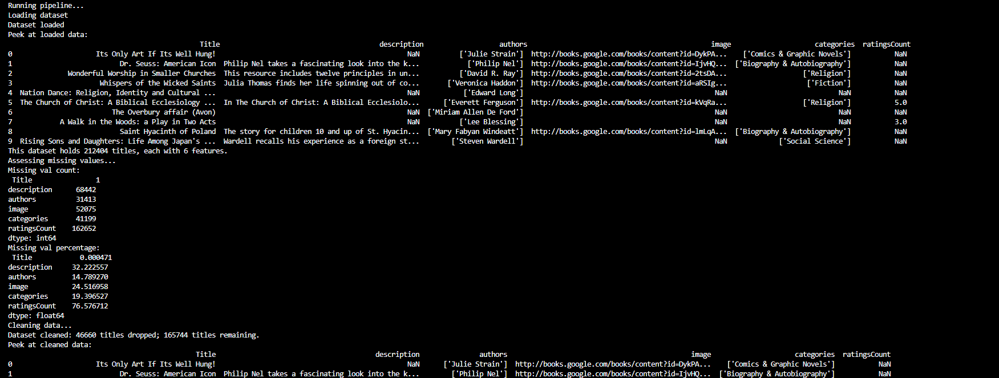

# Machine Learning Book Recommendation system Using Content-Based Filtering

## Machine Learning Pipeline

* **Model Requirements**: This recommender system is a content-based filtering model. While collaborative-filtering (CF) holds strong in situations during which user profiles already exist and share similar patterns in taste, the CF approach suffers from the cold start limitation (i.e. interactions from new users who do not have established history). By contrast, content-based filtering (CBF) is built on existing item metadata and features, making it the optimal choice for individuals. Implementation of two steps: *retrieval* and *ranking*
  Retrieval: generate--retrieve--title candidates for each mentioned title
  Ranking: rank those candidates, remove duplicates or consumed-titles

## Installation

Clone the repository
Download [dataset](https://www.kaggle.com/datasets/mohamedbakhet/amazon-books-reviews?select=books_data.csv)
Open Command-Line Interface:
Run `pip install -r requirements.txt`
Run `python train_model.py`

Example output:

* 
* 

* **Design Considerations**:
* Relevance: Inclusion of both titles and descriptions. A user might solely enter their favorite titles, or they might convey their taste using prose. Titles are presented by ranking
* Freshness: The catalog is frozen at training time, so new books would necessitate retraining. publishedDate feature is also dropped, restricting inference of recency.
* Latency: During the initial data cleaning process, 78% of the titles were dropped due to null values across several of the fields, reducing the dataset to 47,797 titles. After applying a more structured cleaning approach, the dataset regained a significant portion of its size, growing to 165,744 titles. Thus, the model's vocabulary grew to 1,240,874 terms, with non-zero terms growing from 2.46M to 12.7M. Serving costs ~85 ms per query, of which the sparse matrix-vector product consumes 79 ms. Thus, a 3.5x larger catalog produced an 8x slower query.
* Diversity: impacted by duplicate titles with diverse casing, as exhibited in the smoke test. (Now Wait For Last Year vs. Now Wait for Last Year). `ngram_range` hyperparameter account for authors with shared given or surnames (bigrams). Multiple books by the same author restricts diversity.
* Fairness: Some recommender systems are biased toward certain outputs (e.g., books, ads, movies, etc.) due to financial incentive. Despite there being no financial incentive to show preference toward certain titles, this model differs in that recommendations with higher rating weights are probable to be served more frequently--meaning the books with lower ratings have a lower probability of being served, keeping their ratings low. This is referred to as a popularity feedback loop.

### `train_model.py`

* **Data Collection**: Ingests data (`Amazon Books Dataset: books_data.csv, Books_rating.csv`)
* **Data Cleaning/Feature Engineering**: dropping nulls using `load_and_preprocess()`
* **Data Labeling**: N/A...this is an unsupervised learning model that implements retrieval
* **Feature Selection**: Loading data: only load the used columns (i.e., 'Title', 'description', 'authors', 'categories', 'ratingsCount', 'image'). The other columns (i.e., previewLink, publisher, publishedDate, and infoLink) are noise.  This helps streamline data parsing and cleaning, as well as storage management.
* **Model Training**: *Text frequency-inverse document frequency (TF-IDF)* - vectorizes the text; corpus represented as an M x N matrix. The number of titles (M) may differ from size of vocabulary (N), but the size of the vector computed from each vectorized query (i.e., an 1 x N) must be compatible for matrix-vector multiplication to produce a dot product. Thus, the vector will be transposed to dimensions N x 1 to produce the dot product of M x 1, in which each title will have a score. Titles that are closer together in vector space will have a larger dot product or cosine similarity score. Titles are then sorted in descending order according to their scores so that similar titles are served based on the specified *k*.
* **Model Evaluation**: When building some recommendations (e.g., *You Might Like*, *Because You Watched*, *For You*, etc.), the goal is to minimize the distance from a user's favorite book title to another title, expressed as ||vt^k - vt^i||. This model uses a leave-one-out with precision@k evaluation method: i.e., consider users with 5+ liked titles, hide one title, build a query from the rest, evaluate whether the hidden book returns. Use W&B to sweep across `max_features` and `min_df` hyperparameters--strikes the balance between *memory* and *precision*.
* **Model Deployment**: Docker containerization, AWS
* **Model Monitoring**: AWS

## Learning lessons

### Framing

The underlying problem this project solves is a retrieval problem, not a prediction problem. I've built several classification and regression models, so this problem required mental reframing to shift to retrieval. While the former conventionally models call `.fit` on the estimator, then `.predict`to generate the outputs, this model calls `.fit_transform` on the model, then `.transform` on any presented queries. This systematically trains the vectorizer on the corpus of titles so that it can learn the present terms and weight each one accordingly. Once the titles and their composing terms are learned and vectorized into a higher dimension (i.e., a matrix of titles(M) x features(n)), any presented queries are then vectorized into that same dimension. This results in each query being transformed into a vector of 1 x features(n). Additionally, `.fit_transform` serves as the optimal application rather than `.fit` -> `.transform` given that `.fit_transform` optimizes for memory by producing the sparse matrix without tokenizing the corpus a second time. However, if during the model training phase, one irresponsibly calls `.fit_transform` on the query, as opposed to `.transform`, the model retrains on the query. Thus, the model's entire knowledge becomes restricted to those words and it has no context of the substantial vocabulary it just learned.
